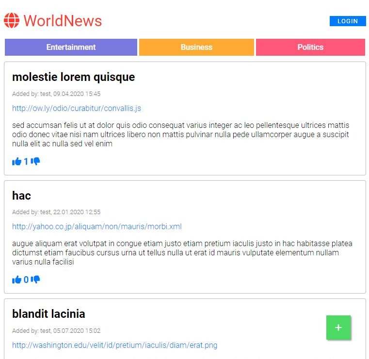

# WorldNews

WorldNews is a Reddit-like web application written in Jakarta EE. Users can create accounts, share discoveries, and vote on posts with an upvote or downvote system. The project uses a MySQL database for data storage and follows standard web development practices with Jakarta Servlet and JSP.



## Features

- **User Authentication**: Register, log in, and manage user accounts securely.
- **Post Discoveries**: Share interesting news, thoughts, or discoveries.
- **Vote System**: Engage with posts using an upvote or downvote feature.


## Technologies Used

- **Jakarta EE**: For building robust and scalable web applications.
- **Java 22**: Core language for the application.
- **MySQL**: Database for persisting user accounts and posts.
- **JSTL**: Jakarta Standard Tag Library for rendering dynamic content in JSP.
- **Apache Commons Codec**: For utility functions like encoding and decoding.
- **Maven**: For dependency management and building the project.

## Prerequisites

- **JDK 22** or later.
- **Apache Tomcat** or any Jakarta EE-compatible application server.
- **MySQL Database**
- **Maven** for building and managing dependencies.

## Getting Started

### Setting Up the Environment

1. Clone the repository:
   ```bash
   git clone https://github.com/your-username/worldnews.git
2. To create a MySQL database run the provided SQL script in
    ```bash
    src/main/resources/db/schema.sql 
to set up tables.
3. Update web.xml or configuration files with your database credentials.

4. Build the project (.war file)

5. Deploy the generated WAR file (worldnews.war) to your application server.

6. Access the application via your browser:
    ```bash
    http://localhost:8080/worldnews